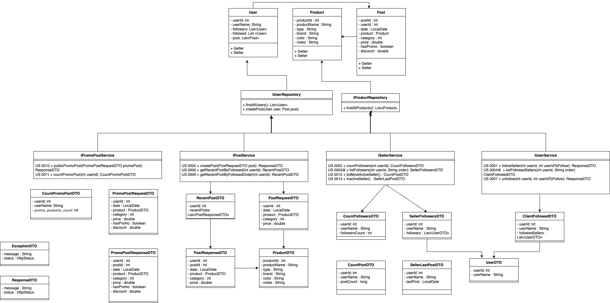

# Social Meli

---


## Integrantes

- Ana Maria García Acosta
- Angela Tatiana Daza Rojas
- Leandro Jossue Ramirez Vezga
- Sebastian Vallejo Rangel
- Vanessa Lozano Landinez

## Descripción del Proyecto

Social Meli es una aplicación desarrollada con Spring Boot que permite gestionar las relaciones entre usuarios y vendedores, sus publicaciones y productos en promoción.

## Tecnologías Utilizadas

- **SDK:** 22
- **Java:** 21
- **Spring Boot:** 3.3.4

### Dependencias

- **Spring Dev Tools**
- **Spring Web**
- **Lombok**

---

## Estructura del Proyecto

El proyecto está compuesto por las siguientes entidades:

- **User**
- **Post**
- **Product**

### Controladores y Servicios

Se implementan cuatro controladores, cada uno con sus respectivos servicios:

- **Post Controller**
- **Promo Controller**
- **Seller Controller**
- **User Controller**

A continuación, se presenta un diagrama que ilustra la estructura del proyecto, incluyendo los DTOs, repositorios e interfaces utilizadas:

<p align="center"></p>

---

## Cómo Ejecutar el Proyecto

Para probar ejecutar y hacer uso del proyecto se cuenta con una collección de Postman con los request necesarios para verificar cada user story.
Este archivo se encuentra en: 
```src/main/resources/Sprint I.postman_collection.json
```


---

